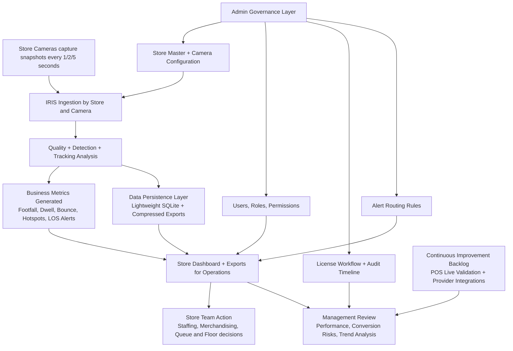

# IRIS Management Process View (BRD-Level)

This document explains the IRIS project in plain business language for leadership, operations, and non-technical stakeholders.

## 1) One-line explanation

IRIS converts store camera snapshots into business-ready insights (footfall, dwell, hotspots, alerts), with role-based control, audit trails, and low-cost operations.

## 2) Executive process diagram (simple)

## 3) Step-by-step business journey

1. **Capture**
   - Each store camera captures snapshots at agreed interval (1s/2s/5s).
2. **Analyze**
   - IRIS processes snapshots and detects people movement patterns.
3. **Generate KPIs**
   - IRIS produces footfall, dwell time, bounce, hotspots, and risk alerts.
4. **Operate**
   - Store teams view dashboards and take day-to-day actions.
5. **Govern**
   - Admin manages stores, users/roles, licenses, routes, and controls access.
6. **Review**
   - Management reviews trends and escalation points across stores.
7. **Improve**
   - Next phase connects POS validation and live provider dispatch.

## 4) Who uses what

- **Admin**: controls setup and governance (stores, cameras, users, permissions, licenses).
- **Store User**: manages only their store operations and staff assets.
- **Management Viewer**: read-only cross-store insights for decisions.

## 5) What updates where (non-technical)

- Dashboard actions update the central IRIS database.
- Analysis output updates export files and dashboard views.
- License status changes write an audit history automatically.
- Alert route rules are stored and reused for future dispatch.

## 6) Management value

- Better store decisions with measurable evidence.
- Standardized review across 100+ stores.
- Controlled access and clear accountability.
- Lightweight infrastructure for lower operating cost.
- Strong base for POS-validated business outcomes.

## 7) Current status summary for management

- ✅ Live: analytics + dashboard + governance basics + role model + license audit + route registry.
- 🟡 Next: POS live adapter and real Slack/WhatsApp provider integration.
