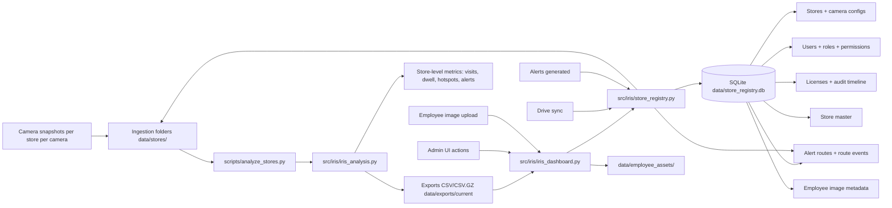

# IRIS End-to-End Data Flow Architecture

## 1) High-level data flow

## 2) What is already developed

- Snapshot analysis engine for N-camera stores with per-frame outputs and summary metrics.
- Camera role handling (`ENTRANCE`, `INSIDE`, `BILLING`, `BACKROOM`, etc.) with billing/backroom exclusion from customer behavior analytics.
- Cross-camera visit stitching field (`global_visit_id`) for multi-camera grouping baseline.
- Auth/RBAC runtime with user-role-permission storage and admin controls.
- License workflow runtime with state transitions + audit timeline.
- Alert route registry and alert event logs (provider adapters are next).
- Store master import and admin persistence.

## 3) Access model and update points

- **Admin users** access all tabs and can create stores/users/roles/routes/licenses.
- **Store users** are expected to be scoped by store and staff management permissions (as configured by role permissions).
- **Management viewers** are read-only analytics consumers.

All state-changing UI operations write into SQLite through `store_registry.py` and are reflected immediately in dashboard tables.

## 4) Lightweight/server-ready design

- SQLite for compact metadata persistence.
- JPEG optimization for uploaded/synced images.
- Optional gzip exports to reduce storage.
- Pipeline remains filesystem + DB centric to keep infra cost low for 100+ stores.

## 5) Pending integrations (explicit)

- POS live integration adapters for conversion/loss-of-sale validation.
- Real external provider dispatch adapters (Slack/WhatsApp live APIs, webhook hardening).
