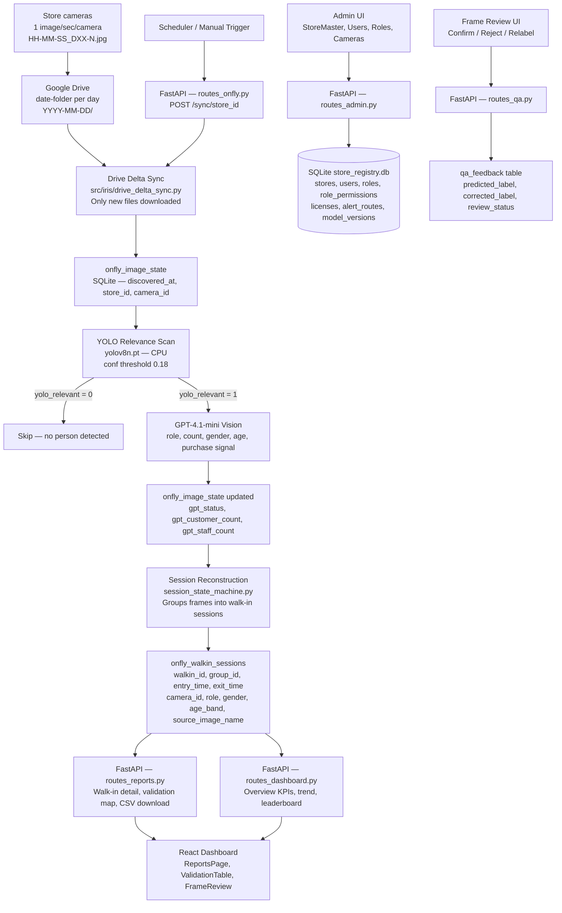

# IRIS End-to-End Data Flow Architecture

**Last updated:** 2026-04-30

---

## 1. High-Level Data Flow

```mermaid
flowchart TD
  A[Store cameras\n1 image/sec/camera\nHH-MM-SS_DXX-N.jpg] --> B[Google Drive\ndate-folder per day\nYYYY-MM-DD/]

  B --> C[Drive Delta Sync\nsrc/iris/drive_delta_sync.py\nOnly new files downloaded]
  C --> D[onfly_image_state\nSQLite — discovered_at, store_id, camera_id]

  D --> E[YOLO Relevance Scan\nyolov8n.pt — CPU\nconf threshold 0.18]
  E -->|yolo_relevant = 0| F[Skip — no person detected]
  E -->|yolo_relevant = 1| G[GPT-4.1-mini Vision\nrole, count, gender, age, purchase signal]

  G --> H[onfly_image_state updated\ngpt_status, gpt_customer_count, gpt_staff_count]
  H --> I[Session Reconstruction\nsession_state_machine.py\nGroups frames into walk-in sessions]
  I --> J[onfly_walkin_sessions\nwalkin_id, group_id, entry_time, exit_time\ncamera_id, role, gender, age_band, source_image_name]

  J --> K[FastAPI — routes_reports.py\nWalk-in detail, validation map, CSV download]
  J --> L[FastAPI — routes_dashboard.py\nOverview KPIs, trend, leaderboard]

  K --> M[React Dashboard\nReportsPage, ValidationTable, FrameReview]
  L --> M

  N[Admin UI\nStoreMaster, Users, Roles, Cameras] --> O[FastAPI — routes_admin.py]
  O --> P[(SQLite store_registry.db\nstores, users, roles, role_permissions\nlicenses, alert_routes, model_versions)]

  Q[Frame Review UI\nConfirm / Reject / Relabel] --> R[FastAPI — routes_qa.py]
  R --> S[qa_feedback table\npredicted_label, corrected_label, review_status]

  T[Scheduler / Manual Trigger] --> U[FastAPI — routes_onfly.py\nPOST /sync/store_id]
  U --> C
```

---

## 2. Pipeline Stages in Detail

### Stage 1 — Drive Sync (`src/iris/drive_delta_sync.py`)

- Connects to Google Drive using `GOOGLE_API_KEY`
- Scans only subfolders matching `YYYY-MM-DD` pattern
- Downloads only files not already present in `onfly_image_state` (delta mode)
- Image naming convention: `HH-MM-SS_D<camera>-<lens>.jpg` (e.g. `12-27-16_D13-1.jpg`)
- Time extracted from filename — not from file metadata (metadata timestamps are unreliable)

### Stage 2 — YOLO Relevance Scan (`src/iris/onfly_pipeline.py`)

- Model: `yolov8n.pt` (YOLOv8 nano, CPU-only, ~6MB)
- Confidence threshold: `0.18` (configurable via `YOLO_CONF` env var)
- Output written to `onfly_image_state.yolo_relevant` (1 = person present, 0 = skip)
- Also writes `person_count` per frame
- Non-relevant frames are permanently skipped in GPT stage

### Stage 3 — GPT Vision Analysis (`src/iris/onfly_pipeline.py`)

- Model: `gpt-4.1-mini` (vision mode)
- Called only for frames where `yolo_relevant = 1`
- Prompt extracts: dominant role (customer / staff / banner / pedestrian), individual count, gender, age band, purchase signal (bag visible)
- Result written to `onfly_image_state`: `gpt_status`, `gpt_customer_count`, `gpt_staff_count`, `gpt_banner_count`, `gpt_pedestrian_count`
- `gpt_status` values: `done`, `failed`, `disabled` (GPT toggled off), `pending`

### Stage 4 — Session Reconstruction (`src/iris/session_state_machine.py`)

- Groups consecutive relevant frames from the same camera into a single walk-in session
- Assigns `entry_time` (first frame) and `exit_time` (last frame) from filename timestamps
- Generates `walkin_id` (e.g. `W-BLR-20260409-0157`) and `group_id` (e.g. `G-0052`)
- Writes to `onfly_walkin_sessions` — one row per unique walk-in

### Stage 5 — API Layer (`backend/app/api/`)

- All data served from `onfly_walkin_sessions` and `onfly_image_state` via SQLite
- FastAPI routes are async; DB reads use sync SQLite connection (primary) with async PostgreSQL as fallback
- JWT auth required on all endpoints

### Stage 6 — Validation Image Matching (`backend/app/api/routes_reports.py`)

Image-to-session matching priority (camera-first, as of 2026-04-30):

1. **Direct match** — `source_image_name` in session matches `image_name` in `onfly_image_state`
2. **Same-camera time window** — images from the same `camera_id` captured between `entry_time` and `exit_time`
3. **Cross-camera fallback** — any camera in the time window (marked `⚠ Cross-camera` in UI)
4. **Nearest-neighbour** — closest image within 300s, same-camera pool preferred

---

## 3. Key Database Tables

All tables defined in `backend/app/db/canonical_metadata.py`.

| Table | Written by | Read by | Purpose |
| --- | --- | --- | --- |
| `onfly_image_state` | `onfly_pipeline.py` | `routes_reports.py`, `routes_qa.py` | Per-image YOLO + GPT results |
| `onfly_walkin_sessions` | `session_state_machine.py` | `routes_reports.py`, `routes_dashboard.py` | Customer walk-in session records |
| `pipeline_run_log` | `routes_onfly.py`, Celery tasks | `routes_runs.py`, Scheduler UI | Job execution history |
| `qa_feedback` | `routes_qa.py` (Frame Review) | `routes_qa.py` | Human-reviewed frame labels |
| `stores` | `routes_admin.py` | All routes | Store registry and Drive config |
| `users` / `roles` / `role_permissions` | `routes_admin.py` | `routes_auth.py`, all protected routes | RBAC |
| `report_store_day_summary` | Pipeline (daily rollup) | `routes_reports.py` | Daily store KPIs |
| `model_versions` | `routes_qa.py` (retrain) | `routes_qa.py` | ML model version registry |

---

## 4. Access Model

| Role | Access |
| --- | --- |
| **Admin** | Full access — store/user/role/camera CRUD, all reports, pipeline triggers, QA review |
| **Store User** | Own store only — walk-in reports, employee management, pipeline status |
| **Management Viewer** | Read-only — analytics dashboard, reports, no config changes |

All access control enforced by JWT + RBAC in `backend/app/auth/dependencies.py`.

---

## 5. What Is Built and Working (as of 2026-04-30)

| Feature | Status |
| --- | --- |
| Drive delta sync | Done |
| YOLO relevance scan | Done |
| GPT-4.1-mini vision analysis | Done |
| Walk-in session reconstruction | Done |
| Walk-in session → validation report with camera-correct image matching | Done (fixed 2026-04-30) |
| React dashboard: Overview, Reports, Scheduler, Frame Review | Done |
| Auth/RBAC (JWT + bcrypt) | Done |
| Store master, employee management, camera zones | Done |
| Celery job queue (drive_sync, yolo_scan, gpt_analysis, report) | Done |
| BoT-SORT multi-camera person tracker | Implemented — staged rollout |
| PostgreSQL migration (Alembic) | Scripts ready — not yet run in production |
| Live GPT pipeline on Apr 23+ store data | Pending — currently only seeded Apr 8–9 data |
| Cloud deployment (AWS/GCP/Azure) | Not started |
| POS live integration | Not started |
| WhatsApp/Slack alert dispatch | Not started |

---

## 6. Lightweight Design Choices

- **SQLite** as primary runtime DB — zero server process, works on laptop and in Docker. PostgreSQL migration scripts (`alembic`) are ready for when concurrent writes require it.
- **In-memory image processing** — images are never written to disk during YOLO/GPT analysis. Only metadata and counts are persisted.
- **Delta sync** — only new Drive files are downloaded. Existing files are reused from local disk.
- **YOLO as relevance gate** — ~80% of frames have no person. YOLO filters these out before the expensive GPT API call, reducing cost significantly.
- **Static React bundle served by FastAPI** — no separate frontend server or nginx required. One process serves both API and UI.
